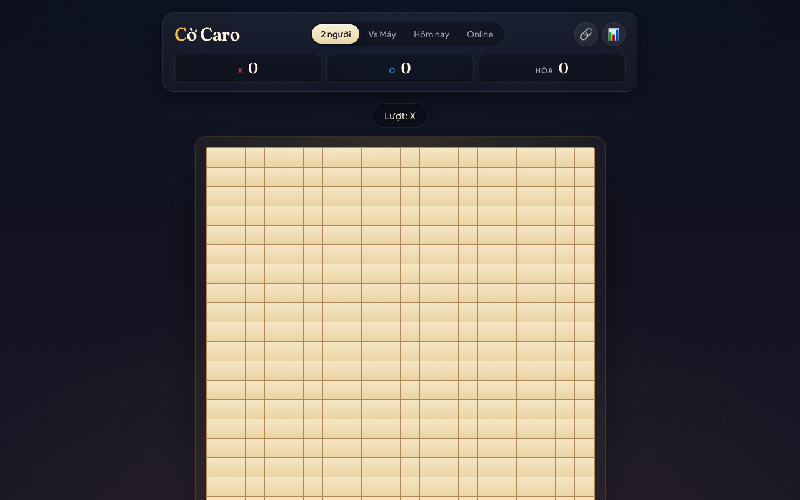

# Cờ Caro VN — Web Game

> **Live:** [https://ninetysixxx.github.io/caro-game/](https://ninetysixxx.github.io/caro-game/)
>
> Cờ caro Việt Nam chạy trên trình duyệt: board 20×20, win = 5 liên tiếp, **chặn 2 đầu = không tính**.



---

## Tính năng

- **4 chế độ chơi:**
  - **2 người** (hotseat trên cùng máy)
  - **Vs Máy** — AI 3 cấp độ (Dễ / Vừa / Khó), heuristic <500ms/lượt
  - **Online** — 2 người chơi real-time qua mạng (WebSocket)
  - **Hôm nay** — Daily Puzzle: giải puzzle theo ngày (win-in-N / block-in-N)
- Undo nước đi (trước khi game kết thúc)
- Theo dõi điểm số, thống kê, streak (localStorage)
- Chia sẻ kết quả puzzle dạng emoji grid + snapshot bàn cờ
- Highlight nước cuối + vẽ đường thắng (SVG animated)
- Responsive từ 320px đến desktop
- Accessibility: ARIA labels, `aria-pressed`, `prefers-reduced-motion`

---

## Cấu trúc dự án

```
.
├── caro-game/                  # Frontend (GitHub Pages)
│   ├── index.html
│   ├── styles.css
│   ├── manifest.json            # PWA manifest
│   ├── sw.js                    # Service Worker (offline cache)
│   ├── icons/                   # PWA icons
│   ├── vendor/                  # gif.js (replay GIF fallback)
│   └── js/                      # ~30 module JS (ES modules, <200 LOC/file)
│       ├── main.js              # Bootstrap + event router
│       ├── game.js              # Rules, win detection
│       ├── ui.js                # DOM render + event delegation
│       ├── ai*.js               # AI engines (easy / medium / hard)
│       ├── puzzle-*.js          # Daily puzzle engine + bank + UI
│       ├── daily-controller.js  # Daily puzzle lifecycle
│       ├── multiplayer-*.js     # WebSocket client + controller
│       ├── room-ui.js           # Create/join room modals
│       ├── score-store.js       # Score persistence
│       ├── streak.js            # Streak tracking
│       ├── stats.js / stats-ui.js
│       ├── share.js / share-formatter.js
│       ├── replay-*.js          # Replay renderer + encoder
│       └── ...
│
├── caro-server/                  # Backend (Cloudflare Workers)
│   ├── wrangler.toml             # Worker config
│   ├── package.json
│   └── src/
│       ├── index.js              # HTTP routes + CORS + room routing
│       └── room-durable-object.js  # WebSocket room state (Durable Objects)
│
├── .github/workflows/
│   └── deploy.yml                # Auto-deploy frontend → GitHub Pages
│
└── docs/
    └── DEPLOY.md                 # Hướng dẫn deploy chi tiết
```

---

## Chạy local

### Frontend

ES modules cần HTTP server (không chạy với `file://`):

```bash
cd caro-game
python3 -m http.server 8000
# hoặc
npx serve .
```

Mở `http://localhost:8000`.

> Chế độ **Online** cần `window.CARO_SERVER_URL` trỏ đến backend Worker. Đã được set trong `index.html`.

### Test puzzle

```bash
cd caro-game
node js/test-daily.mjs
```

---

## Deploy

### 1. Deploy Backend (Cloudflare Workers)

```bash
cd caro-server
npx wrangler deploy
```

**Output mong đợi:**

```
Published caro-server (2.17 sec)
  https://caro-server.dlinh.workers.dev
```

> Nếu URL khác, cập nhật `window.CARO_SERVER_URL` trong `caro-game/index.html` và push lại.

### 2. Deploy Frontend (GitHub Pages)

Push lên `main` branch — GitHub Actions tự động deploy:

```bash
git add .
git commit -m "feat: update game"
git push origin main
```

Kiểm tra tab **Actions** trong repo. Site live sau ~1 phút tại:

```
https://ninetysixxx.github.io/caro-game/
```

> Xem `docs/DEPLOY.md` để biết thêm chi tiết, troubleshooting, và hướng dẫn cấu hình custom domain.

---

## Luật chơi — Caro VN

- **Win:** 5 quân liên tiếp (ngang / dọc / chéo)
- **Chặn 2 đầu:** nếu cả hai đầu của dãy 5 bị đối thủ chặn (hoặc cạnh bàn) → **không tính thắng**
- **Long-line (6+):** tính thắng

---

## Công nghệ

| Layer | Tech |
|-------|------|
| Frontend | Vanilla JS (ES modules), HTML5, CSS3 — **no framework, no build step** |
| Backend | Cloudflare Workers + Durable Objects (WebSocket rooms) |
| Persistence | localStorage (scores, stats, streak) |
| Deploy | GitHub Actions → GitHub Pages (frontend) + Wrangler (backend) |
| Testing | Node.js test runner (`js/test-daily.mjs`) |

---

## Chế độ Online

- **Tạo phòng:** chọn chế độ "Online" → "Tạo phòng" → sao chép mã 4 ký tự gửi bạn bè
- **Vào phòng:** chọn "Vào phòng" → nhập mã
- **Real-time:** mỗi nước đi đồng bộ ngay lập tức qua WebSocket
- **Backend:** Cloudflare Durable Objects đảm bảo 2 người vào cùng 1 phòng dù ở xa nhau

---

## License

MIT
